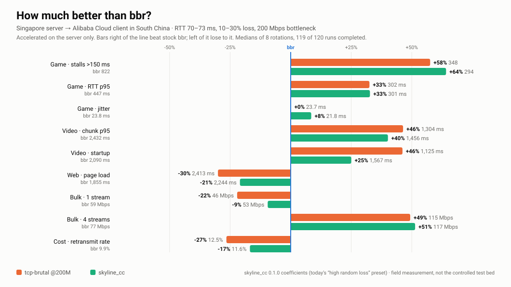

<div align="center">

# Skyline Speeder

**面向高丢包、高延迟链路的单边 TCP 加速，基于 eBPF**

*Sender-side TCP acceleration for high-loss, high-latency links, built on eBPF. Clients need no changes.*

[](LICENSE)
[](#内核版本要求)
[](install.sh)
[](bpf/)
[](rust-toolchain.toml)

**[English](README.md)** · 简体中文

---

### 由 **[Skyline Connect](https://www.skylineconnect.io)** 独家冠名

*Exclusively sponsored by [Skyline Connect](https://www.skylineconnect.io)*

---

</div>

## 这是什么

Skyline Speeder 是一套单边 TCP 加速软件：以 eBPF 程序的形式只运行在发送数据的服务器上，面向丢包严重、往返时延长、标准 TCP 在其上几乎跑不起来的链路。它的做法是让发送速率保持在这条路径实际能交付的水平，而不是每丢一个包就把速率砍下来，以此提高这类链路上的吞吐。接收端不做任何改动。

### 原理

BBR 靠估计带宽而不是对每次丢包作出反应，但它仍会向丢包让步：内核里的 BBR 每次进入丢包恢复都会先退到"包守恒"（收到几个确认才发几个包），每次超时重传后更是从 1 个包重新开始。在一条与排队无关、随机丢掉 10%-20% 报文的链路上，丢包恢复和超时成了常态，RTT 在 100-300 ms 时它的吞吐逐次运行起伏很大，经常直接崩掉。Skyline Speeder 在发送端用 eBPF 实现的 `tcp_congestion_ops`（`struct_ops`）替换拥塞控制，并只基于一个前提：**丢包本身不携带拥塞信息。**

- **速率来自测量，而不是丢包。** 每一轮测量投递速率（取最近几轮的峰值）和基准 RTT；每个 ACK 到来时，在包括丢包恢复在内的所有 TCP 状态下，直接把窗口设为 `带宽 × 基准 RTT × 增益`。丢包本身永远不会让窗口缩小，也没有需要慢慢爬出来的"包守恒"阶段。
- **丢包补偿。** 在丢包率为 `p` 的路径上，投递速率比实际需要发送的量少了 `(1 - p)`。窗口和速率会按这条流自己测得的丢包率放大 `1 / (1 - p)`，最多放大到配置的上限。
- **Pacing。** 数据经 `fq` 队列以 `带宽 × 增益 × 补偿系数` 的速率均匀发出，而不是成批倾泻，并受硬性速率上限约束；窗口只需要不成为瓶颈。
- **两个阶段。** STARTUP 用较高的增益尽快摸到路径带宽；带宽连续几轮不再增长后，进入 CRUISE。
- **拥塞护栏。** 只有两个信号算真实拥塞：排队时延超过阈值（固定值与基准 RTT 的一定比例取较大者），以及 ECN 标记。任一出现，这一轮的增益就降到 `guardrail_gain`，低于测得的带宽；下一轮信号消失即恢复。
- **有上限的 RTO**（可选）。一个 cgroup sockops 程序按连接限制内核的重传超时，避免线路抖一下就让连接最长等上两分钟。

Rust 编写的 `skyline-speederd` 负责加载 BPF 对象（每个对象加载时都要过内核验证器），并通过双缓冲槽在线下发新系数，每条流在 RTT 边界切换过去；`ssctl` 是它的命令行。

> [!IMPORTANT]
> **这个前提只对与排队无关的丢包成立。** 如果链路的丢包其实是拥塞瓶颈上的排队溢出，丢包补偿与排队护栏会朝相反方向用力，只会更糟。简单判断：固定速率的 UDP 打流不丢包、TCP 却大量重传，说明丢包是自身突发造成的排队溢出，这时不该用本工具。它也不追求公平：不会刻意和竞争的流平分链路。

## 实测性能

bbr、[tcp-brutal](https://github.com/HyNetworks/tcp-brutal) 与 skyline_cc 在一条真实跨境链路上的对比，三者都只部署在服务端，通过同一套按目的地前缀的路由覆盖生效，客户端全程使用原生 TCP。

| | 位置 | 角色 |
|---|---|---|
| **服务端** | **新加坡** KVM VPS · 10 Gbps | 发送方，唯一被加速的一端 |
| **客户端** | **阿里云** ECS，**华南（广东）** · 200 Mbps | 接收方，原生 TCP，不做任何改动 |

RTT 70-73 ms、丢包 10%-30%，测于晚高峰。skyline_cc 使用 0.1.0 时随附的默认系数，即现在 [使用与调参指南](docs/usage.md) 里的「高随机丢包档」；**当前的默认系数没有在这条链路上测过**。tcp-brutal 为 v2.0.0，速率 200 Mbps；bbr 为内核自带版本。

<picture>
  <source media="(prefers-color-scheme: dark)" srcset="docs/images/single-ended-ataglance-dark.svg">
  
</picture>

8 轮 × 3 算法 × 5 场景 = 120 次运行，119 次完成。每轮轮换算法顺序，避免链路在测试中劣化时偏袒先跑的那个。各场景赢家按轮统计：

| 场景 | 赢家 | 幅度 |
|---|---|---|
| **视频**（6 MB 分块 @ 48 Mbps） | **tcp-brutal** | 启动延迟赢 7/8 轮，分块 p95 赢 6/8 轮 |
| **游戏**（ping-pong，60 msg/s） | **skyline_cc** | 抖动 5/8 轮，卡顿 >150 ms 4/8 轮 |
| **大文件 · 4 并发** | skyline_cc 与 tcp-brutal，都领先 bbr | 中位数 117 / 115 vs 77 Mbps |
| **大文件 · 单流** | bbr 与 skyline_cc 打平，tcp-brutal 垫底 | 4/8、4/8、0/8 轮；中位数 59 / 53 / 46 Mbps |
| **网页加载** | 无稳定赢家 | 逐轮波动大于三者差异 |
| **服务端重传率**（全部场景累计） | bbr 最低 | bbr 10.0%、skyline_cc 11.6%、tcp-brutal 12.3% |

最能说明三种设计差别的是单流结果。**tcp-brutal 发得最多、传得最少：它发出的报文段有 13.9% 是重传，bbr 为 9.9%，skyline_cc 为 11.1%，而它的中位吞吐只有 46 Mbps。** 在 10%-30% 丢包下，它固定的 200 Mbps 远高于这条路径能交付的速率，而"丢了就多发"的开环控制把这个差距全部变成了重传。skyline_cc 自己估计速率，没有一个会被设得过高的目标速率。

> [!NOTE]
> 这是一条链路上的现场测量，不是本仓库正式结论所依据的受控双 VM 测试床，也不代表你的链路。它 70 ms 的 RTT 还低于本项目 100-300 ms 的目标区间，在这个 RTT 下 bbr 从丢包中恢复要容易得多。请把它当作三种算法行为特点的证据，而不是吞吐量跑分。逐轮数据与原始记录见 [research/experiments/single-ended/](research/experiments/single-ended/)；受控测试床结果见 [性能验证报告](docs/04-performance-report.md)。

### 三者的设计差别

|  | bbr | tcp-brutal | Skyline Speeder |
|---|---|---|---|
| 控制结构 | 闭环，探测带宽 | **开环**：速率由你给定 | 闭环，自己估带宽 |
| 因丢包降速 | 间接 | 否 | 否 |
| 需要预知链路带宽 | 否 | **是** | 否 |
| 拥塞自保护 | 有 | 无 | 排队时延 + ECN 护栏 |
| 形态 | 内核内置 | 内核模块（DKMS） | eBPF CO-RE，过验证器 |
| 内核门槛 | 任意 | 5.10 | **6.12 LTS** |

如果你知道出口带宽、它基本固定、且内核较老，tcp-brutal 是更简单的答案。Skyline Speeder 适合带宽未知或会变、需要拥塞护栏与可观测性、且能跑 6.12+ 内核的场景。真正拥塞的瓶颈链路上，两者都不合适。

## 内核版本要求

**Linux 6.12 LTS 或更新**，且 `/sys/kernel/btf/vmlinux` 必须存在。`skyline_cc` 实现的是 4 参数的 `cong_control(sk, ack, flag, rs)` 回调，这个签名自 6.10 才有，更旧的内核会在加载时拒绝该程序。因此 6.1、6.6 两个 LTS 分支，以及 Debian 12 与 Ubuntu 22.04/24.04 的原装内核都不行。

已验证：`6.12.101`、`6.18.42`、`7.1.6` 通过（含 IPv4/IPv6 数据路径冒烟测试）；`6.1.180` 和 `6.6.148` 按设计加载失败。

## 快速开始

```bash
# 在本机从源码构建
curl -fsSL https://raw.githubusercontent.com/CYBERVERSE-Research/skyline-speeder/main/scripts/bootstrap.sh | sudo bash

# 或者安装已发布的版本，不需要编译工具链
curl -fsSL https://raw.githubusercontent.com/CYBERVERSE-Research/skyline-speeder/main/scripts/bootstrap.sh | sudo bash -s -- --prebuilt
```

最小化镜像可能没有 `curl`（`apt-get install -y curl`）或 `sudo`（已经是 root 就去掉）。想先看过脚本再运行（**推荐**，因为它会改变这台机器上所有新建连接的拥塞控制）：

```bash
git clone https://github.com/CYBERVERSE-Research/skyline-speeder.git
cd skyline-speeder
sudo ./install.sh              # 从源码构建
sudo ./install.sh --prebuilt   # 安装已发布的产物，不需要编译工具链
sudo ./install.sh --check      # 只做前置检查，不改动任何东西
sudo ./install.sh --no-enable  # 安装，但不挂载此前没挂载的 skyline_cc
sudo ./install.sh --verbose    # 不显示进度条，改为打印每条命令的输出
sudo ./install.sh --uninstall  # 卸载（保留 /etc/skyline-speeder）
```

安装器会检查内核，构建或下载三个 BPF 对象和 daemon，把 TC 程序指向默认路由所在的网卡（IPv4 或 IPv6；默认路由走 WireGuard 这类隧道时，它会请你自己指定网卡），让每个对象过一遍内核验证器，然后启动 daemon、挂载 `skyline_cc`，并把两者设为开机自启。安装过程中终端只显示一行进度，所有命令的输出都保存在 `/var/log/skyline-speeder-install.log`；装完会列出拥塞控制与 qdisc 改动前后的值，再给出 `ssctl` 用法与调参的简短指南。它会先记录当前使用的拥塞控制与 qdisc（包括出口网卡的根 qdisc），`--uninstall` 时还原。**不安装任何代理，不监听任何端口。**

`--prebuilt` 不需要编译工具链，只需要 `curl`、`tar` 和 `iproute2`（安装器会自动安装）：对象是 CO-RE 的，用固定的 6.12 参考头编译，加载时再按这台机器的内核重定位。预编译的 daemon 在 Ubuntu 24.04 上构建，需要 glibc 2.38 以上以及 `libelf.so.1`、`libz.so.1`（Debian 13、Ubuntu 24.04 及更新版本满足）；用户态更旧的系统请从源码构建。`--release <tag>` 指定版本；连不上 GitHub 的机器，把产物拷过去后用 `SKYLINE_ARTIFACT_URL=/path/to/tarball sudo -E ./install.sh --prebuilt` 安装。它装的是已发布的 release，可能比这份 README 旧：例如 v0.2.0 这个 release 还没有下文「配置」里说的 qdisc 守护，遇到这种情况安装器会明确提示。

> [!IMPORTANT]
> **升级：** 按原来的方式再运行一次安装器即可。新对象通过内核验证器后，它会自己重启 `skyline-speederd`：先让现有连接排空（最多 60 秒），再重新挂载 `skyline_cc`；原先是手工 `ssctl enable` 挂载的主机也一样。用 `ssctl` 做的修改不会保留到重启之后。详见 [CHANGELOG.md](CHANGELOG.md) 的 *Upgrading from 0.2.0*。

日常操作：

```bash
ssctl status    # 运行时状态、内核能力与决策计数器
ssctl flows     # 当前 skyline_cc 活跃连接数
ssctl drain     # 优雅摘除：新连接改走 fallback_cc，再等存量连接结束
```

通过 SSH 执行 `ssctl drain` 总会走到超时，因为你自己的会话就是一条 skyline_cc 连接。这无害：它在开始等待之前就已经让新连接改走 `fallback_cc`。

## 配置

随附的默认值就是调好的值，**绝大多数部署不需要改**。

**模块。** 四个模块默认全开，可单独开关：

| 模块 | 作用 |
|---|---|
| `adaptive-cwnd` | 按测得的带宽设定窗口，加速主要靠它 |
| `loss-classifier` | 丢包补偿：按测得的丢包率放大估计值，而不是退让 |
| `pacing` | 按目标速率均匀发送 |
| `early-loss` | 更早发现丢包（当前内核上只是观测计数） |

```bash
ssctl enable                                  # 全开（默认）
ssctl enable --modules adaptive-cwnd,pacing   # 只开指定模块
ssctl enable --all-off                        # 全关，作为对照基准
```

`ssctl enable` 是全机生效的：挂载成功后会写 `net.ipv4.tcp_congestion_control = skyline_cc`，这台机器上所有新建 TCP 连接都会用它。它还会把 pacing 所依赖的 `fq` 设为 `net.core.default_qdisc` 和出口网卡的根 qdisc（VLAN、bond、网桥则是它下面的物理网卡）。在 `ssctl drain` 之前，这三项被别的东西改掉（例如"一键 BBR"脚本的 sysctl 文件被再次应用）时，daemon 都会改回来，并逐条记日志。刻意搭建的 qdisc（`htb`、`tbf`、`netem`、设了带宽的 `cake` 等）不会被动；在配置里设 `[guard] qdisc = false` 则 qdisc 完全交给你自己。

**系数。** 十七个参数（各类增益、护栏、丢包补偿上限、排队时延阈值、起步行为、速率与窗口上限）可用 `ssctl set-module-config` 在线调整，无需重启。[使用与调参指南](docs/usage.md) 逐个解释了这些参数，并给出四档现成配方，其中「高随机丢包档」适用于确实有 10%-20% 随机丢包的链路。

> [!CAUTION]
> `set-module-config` 是**全量覆盖**，不是增量修改：没写的参数都会被重置为命令行的内置默认值，而不是保持你配置文件里的值。

**动态 RTO 上下限**（默认关闭）。只有 `/sys/fs/cgroup/skyline-speeder` 里的进程建立的连接才会经过 `skyline_policy`；进程不在其中**不会报任何错误**，只是 `ssctl status` 里的 `rack_rto.stats.applied` 一直停在 0。用下面的方式在该 cgroup 里启动服务：

```bash
sudo /opt/skyline-speeder/infra/run-in-skyline-cgroup.sh <你的服务启动命令...>
```

`skyline_cc` 本身是全局的，不需要 cgroup。

**重传包 DSCP 标记**（默认关闭）。

> [!WARNING]
> 随附的 `dscp_value = 0` 只是占位：DSCP 0 表示尽力而为，打上去等于没打。具体数值必须由网络方给出；填成别处已在用的值，流量可能被误分类甚至限速。

## 仓库结构

```
skyline-speeder/
├── install.sh                    一键安装（Debian/Ubuntu）
├── scripts/bootstrap.sh          远程安装入口（curl | sudo bash）
├── bpf/
│   ├── skyline_cc.bpf.c          struct_ops 拥塞控制，每个 ACK 执行
│   ├── skyline_policy.bpf.c      cgroup sockops：选择拥塞控制，动态 RTO 上下限
│   ├── skyline_tc.bpf.c          TC egress：统计与重传 DSCP 标记
│   └── include/skyline_abi.h     BPF 与用户态共享的 ABI
├── crates/
│   ├── skyline-speederd/         常驻控制面
│   ├── ssctl/                    命令行
│   └── skyline-common/           共享 ABI 类型与配置解析
├── config/                       speeder-guest.toml（安装用模板）/ speeder.toml（开发用）
├── packaging/                    systemd 单元
├── infra/                        安装辅助、cgroup 工具、双 VM 测试床
├── research/experiments/         测试 manifest、执行、分析与现场测量
├── docs/                         使用指南、部署、接口参考、设计、性能报告
├── CHANGELOG.md                  版本说明与升级步骤
├── DEPLOY.md                     面向自动化 agent 的确定性部署手册
└── CONTRIBUTING.md               改动不能破坏的不变量
```

## 从源码构建

```bash
sudo apt-get install -y build-essential pkg-config clang llvm \
    libbpf-dev libelf-dev zlib1g-dev bpftool
curl --proto '=https' --tlsv1.2 -sSf https://sh.rustup.rs | sh -s -- -y

make bpf                          # 生成 vmlinux.h 并编译三个 CO-RE 对象
cargo build --workspace --release
make check                        # 格式、静态检查与单元测试

# 让每个对象过一遍内核验证器，不留下任何运行状态
skyline-speederd --config config/speeder.toml --validate-only --verify-bpf
```

Debian 12 上跑 `bookworm-backports` 的 6.12 内核时，`libelf-dev` 也要取 backports 那一份：backports 的 `linux-headers` 会把 `libelf1` 带到 0.192，而 bookworm 的 `libelf-dev` 把 `libelf1` 钉在 0.188，两者装不到一起（该取哪个版本看 `apt-cache madison libelf-dev`）。`install.sh` 会自己算出这一点。

`make bpf` 默认从本机 `/sys/kernel/btf/vmlinux` 读取类型信息；要用别的内核的 BTF，用 `make VMLINUX_BTF=<路径> bpf`；已有生成好的头，用 `make PREBUILT_VMLINUX_H=<路径> bpf`。

## 文档

| 文档 | 内容 |
|---|---|
| **[docs/usage.md](docs/usage.md)** | **新手向：每个开关和参数、现成配方、排障** |
| [docs/01-deployment-guide.md](docs/01-deployment-guide.md) | 构建、安装、配置、验证、调参、回滚 |
| [docs/02-interface-reference.md](docs/02-interface-reference.md) | `ssctl` 命令、控制面线协议、配置字段、事件码 |
| [docs/03-design.md](docs/03-design.md) | 架构与各模块的实现原理 |
| [docs/04-performance-report.md](docs/04-performance-report.md) | 受控测试床：环境、与 bbr 对比的结果、局限性 |
| [research/experiments/README.md](research/experiments/README.md) | 复现性能测试 |
| [DEPLOY.md](DEPLOY.md) | 面向自动化 agent 的确定性部署手册 |

## 参与贡献

请先读 [CONTRIBUTING.md](CONTRIBUTING.md)。本项目有几条硬性不变量：两侧必须逐字节一致的 ABI 结构体、必须短于 16 字节的注册名、与 socket 路径耦合的 systemd `RuntimeDirectory`，以及三个完全不报错的失效点。内核验证器是硬门禁：加载不了的改动不算改动。

## 许可

版权所有 (c) 2026 **CYBERVERSE LLC**，以 **GPL-2.0** 分发，详见 [LICENSE](LICENSE)。

GPL-2.0 不是偏好选择：`skyline_cc.bpf.c` 中有若干段是对 GPL-2.0 Linux 内核算法的
高度贴近的重新实现（源码里逐处标了文件与行号），且三个 BPF 对象都向内核声明了
`GPL`。完整理由与上游归属见 [NOTICE](NOTICE)。

"Skyline Speeder"、"CYBERVERSE" 是 CYBERVERSE LLC 的商标；GPL 对代码的授权不包含
任何商标使用权。

---

<div align="center">

**[Skyline Connect](https://www.skylineconnect.io)** 独家冠名

</div>
