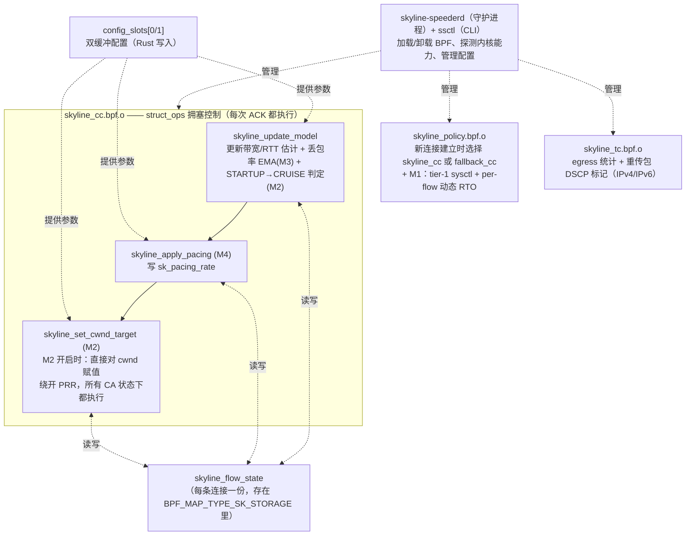
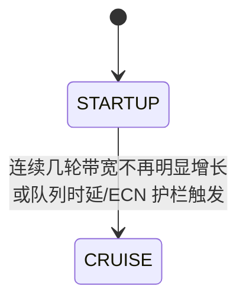

# Skyline Speeder 模块设计说明

本篇面向需要维护或改进 Skyline Speeder 的技术人员，完整描述当前设计：整体架构、每个
模块的机制、模块之间的数据流，以及控制面的实现方式。

## 1. 设计目标与取向

Skyline Speeder 只在 TCP **发送端**部署，不需要改动客户端、不需要改协议头，对标准
客户端完全透明。设计面向的部署环境：丢包率 10%-20%（逐包独立随机丢包，
不是排队拥塞导致的丢包）、RTT 100-300ms、带宽数十到数百 Mbps。

**优化取向**：目标是单流自身的吞吐/完成时间，不追求与其他流的公平共享
带宽。这与标准 CUBIC 的设计初衷（通用互联网、隐含公平性假设）方向相反——
CUBIC 把任何丢包都当作拥塞信号处理，在高随机丢包环境下会把带宽利用率压
到接近于零。

**丢包语义**：Skyline Speeder 只承认两个真实拥塞信号——排队时延增长和 ECN 标记。丢包
本身默认被假设为不携带拥塞信息，不触发任何降窗。

**保留的不变量**：如果把全部四个可选模块关闭，Skyline Speeder 的行为需要约等于内核
原生 CUBIC——这是一条**正确性**不变量（用来验证"模块关闭"这条路径没有
意外副作用），不是公平性要求，两者不冲突。

## 2. 总体架构

Skyline Speeder 由 3 个独立的 BPF 对象 + 1 份共享的每连接状态 + 1 个 Rust 用户态控制
面构成：



要点：

- M2（自适应 cwnd）/M3（丢包率补偿）/M4（pacing）是同一个 struct_ops 回调
  （`skyline_cong_control`，每次 ACK 触发）里顺序执行的几段代码，靠读写同一份
  `skyline_flow_state` 配合，不是三个互相调用的独立程序。
- M1（早期丢包感知）在 `skyline_policy.bpf.c` 里，跟"选择拥塞控制算法"共享同一
  个 cgroup sockops 挂载点，但逻辑完全独立。
- 每个模块能否生效由配置里的一个位掩码 `feature_mask` 控制——不是四份不同
  的代码，而是同一份代码里的条件分支（见 `docs/02-interface-reference.md`
  第 7 节的位定义）。

`bpf/`/`crates/`/`infra/`/`config/` 各目录的职责划分见 `docs/02-interface-
reference.md`（接口层面）和源码顶部注释（实现层面）；本文档只讲机制本身。

IPv4/IPv6 双栈：控制面（Rust 侧）完全不涉及地址概念，只认接口名/Unix
socket/系统 sysctl 路径，双栈不需要任何改动；`skyline_cc`（M2/M3/M4）只碰
`tcp_sock`/`sock` 的地址族无关字段，同样不需要改动。改动集中在两处：
`skyline_tc.bpf.c` 的重传检测新增 IPv6 扩展头遍历分支（有界展开，遇到分片/
认证头/未知扩展头一律放行不处理），`skyline_policy.bpf.c` 的 family 判断同时
接受 `AF_INET`/`AF_INET6`（含 IPv4-mapped 地址，见 `docs/01-deployment-
guide.md` 第 10 节的双栈监听陷阱）。

## 3. 共享状态：`skyline_flow_state`

定义在 `bpf/include/skyline_abi.h`，存在一个 `BPF_MAP_TYPE_SK_STORAGE` 类型的
map 里——这是**逐 socket**存储，随连接创建自动分配、随连接销毁自动释放。
"共享"指的是"同一条连接内部，M2/M3/M4 之间共享"，不是"所有连接共享同一份
数据"。

字段分四类：

| 类别 | 代表字段 | 消费者 |
|---|---|---|
| 拥塞/带宽估计 | `min_rtt_us`/`min_srtt_us`/`bw_bps`/`bw_samples[10]`/`round_count` | 所有模块共享的底层估计器 |
| 模式机状态 | `mode`（STARTUP/CRUISE）、`plateau_rounds`、`queue_clamped` | M2 |
| 丢包率信号 | `loss_rate_permille`、`last_lost`、`last_loss_rate_delivered` | M3 消费，计算本身独立于 `feature_mask` |
| CUBIC 增长核心状态（仅 M2 关闭路径） | `w_max`、`epoch_start_ns`、`epoch_k_ms`、`tcp_cwnd`、`ack_cnt` | 框架层的 CUBIC 增长核心 + M2 关闭时的降窗 |
| PRR 状态（仅 M2 关闭路径） | `prior_cwnd`、`prr_delivered`、`prr_out`、`recovery_active` | 框架层的 PRR 实现，M2 开启时完全绕开 |

无论模块开关如何，持续更新的底层估计器：`min_rtt_us`（历史最低 RTT，超过
`min_rtt_window_s` 未刷新过允许接受更大新值，防止路径变化后死守旧值）、
`bw_bps`（最近 `bw_window_rtts` 轮里的峰值投递速率，只用未被应用层限速的
样本）、`round_count`（"这一批发出去的数据全部被确认"作为一轮边界）、
`loss_rate_permille`（这条流自己测得的丢包率，指数滑动平均，alpha=1/4）。

## 4. 中性基线：模块全关时的框架层

如果把 M1-M4 全部关闭（`enabled_modules=[]`），Skyline Speeder 的目标是表现约等于内核
原生 CUBIC，而不是"随便跑"。这条基线是后续"打开某个模块提升多少"这个问题
有意义的前提。

M2 开启时，`skyline_cong_control()` 直接掌管 cwnd，完全不经过这里的 PRR/CUBIC
增长核心；只有 M2 关闭时，下面三块框架级实现才会实际执行：

**PRR 重实现**（`prr_pacing_enabled`，默认开启）：Skyline Speeder 使用 `cong_control`
struct_ops 回调，内核会因此把自己的 PRR 恢复期限速逻辑整段跳过。Skyline Speeder 自己
重新实现一份等价的逐 ACK 限速（`skyline_apply_prr()`），在整个恢复期内每次
ACK 都限制发送量，而不是只在恢复开始时降一次窗——否则 cwnd 降低了，但发
送节奏不受控，一个 RTT 内就能把降低后的 cwnd 打满。

**Auto-pacing**（`auto_pacing_enabled`，默认开启）：M4 关闭时，pacing 速率
按内核自身公式（慢启动阶段/拥塞避免阶段两档比例）计算一个等价的封顶速率，
保证"M4 关闭"和"内核原生 pacing 行为"一致。

**CUBIC 增长核心**（M2 关闭时的 cwnd 增长路径）：完整复刻内核 CUBIC 的三次
函数增长公式（`K` 在每个增长周期开始时算一次并冻结）、"曲线还没追上当前
cwnd"时的近似冻结分支，以及一个独立维护的 Reno 风格增长下限（TCP-
friendliness 地板，防止极短拥塞周期下增长长期趋近于 0）。

这三块合起来保证：无论 M1-M4 开关如何组合，只要 M2/M4 关闭，cwnd 增长和
pacing 行为都精确对齐内核原生实现。

## 5. M1：早期丢包感知

Linux 内核自带的 RACK（Recent Acknowledgment）+ TLP（Tail Loss Probe）用
"发送时间域"而非序列号/重复确认计数判断丢失置信度，已经完整覆盖了丢包检
测这个问题空间。M1 不重新发明这套判丢逻辑，而是定位成**参数的观测驱动动
态调节层**：内核提供了判丢机制本身，但很多关键参数默认是全局静态值，M1
按每条连接的实时观测去调节这些参数。

**两个互不相关的部分**：`enabled_modules` 里的 `early-loss` 位（M1 在
`skyline_cc.bpf.c` 里的部分）目前只是一个观测计数器（`metrics.
hypothetical_early_loss`），不驱动任何决策，也不控制本节剩余部分描述的
行为（详见第 13 节）。本节实际讲的 tier-1 全局 sysctl 与 tier-2 per-flow
动态 RTO，由 `[rack_tuning]`/`[rack_rto]` 两段独立配置驱动，跟
`enabled_modules`/`ssctl enable`/`ssctl disable --module early-loss`
完全无关——即便 `early-loss` 从未出现在 `enabled_modules` 里，只要
`[rack_rto].enabled=true`，tier-2 RTO 调节依然生效。

**内核暴露的调节接口按暴露程度分三档**：

| 档次 | 内容 | 能否调节 |
|---|---|---|
| 第一档：全局 sysctl | `tcp_recovery`（位掩码）/`tcp_reordering`/`tcp_early_retrans` | 可写，但粒度是整个网络命名空间，不能按连接区分 |
| 第二档：逐连接自适应、但不对外暴露写接口 | `tp->reordering`、`tp->rack.reo_wnd_steps` | 只能改初始值，改不了自适应逻辑本身；但 `TCP_BPF_RTO_MIN`/`TCP_RTO_MAX_MS` 这两个相关的 RTO 参数可以通过 `bpf_setsockopt` 从 sockops 程序按连接单独设置 |
| 第三档：完全硬编码 | `reo_wnd` 基础量子、`reo_wnd_steps` 上限、恢复阈值等 | 没有任何暴露接口（sysctl/setsockopt/bpf_setsockopt 均无），需要内核补丁才能按连接动态调整 |

M1 当前只做第一档 + 第二档里 RTO 相关的部分，不涉及需要内核补丁的第三档：

**tier-1（全局 sysctl）**：`skyline-speederd` 启动时把配置里 `[rack_tuning]` 声明的
`tcp_recovery`/`tcp_reordering`/`tcp_early_retrans` 一次性写入
`/proc/sys/net/ipv4/*`，写入失败即致命退出。

**tier-2（per-flow 动态 RTO 下限 + 上限）**：`skyline_policy.bpf.c` 订阅
`BPF_SOCK_OPS_RTT_CB`（每次有新 RTT 样本时触发），两个独立可开关的半部分
共享这一个订阅：

- **下限**：`target = max(实测srtt, min_rtt) × 可调系数`，夹在配置好的绝
  对上下限之间（不超过内核 `TCP_RTO_MIN` 200ms），跳过前 N 个样本，目标值
  不变则跳过写入，通过 `bpf_setsockopt(TCP_BPF_RTO_MIN)` 应用。
- **上限**：内核的 RTO 真正上限（`TCP_RTO_MAX`，约 120 秒）和失败重传后的
  指数退避会把下一次 RTO 顶到接近这个量级——而随机独立丢包场景下，一次丢
  包和下一次互相独立，等更久不会提高"下次重传就成功"的概率。这一半用同一
  个 RTT_CB 读到的 `srtt`/`min_rtt` 算出 `base_rtt = max(srtt, min_rtt)`
  （跟下限用同一个抗乱序基线——单独用 `min_rtt` 在重排序场景下可能塌陷到
  0），乘一个倍数 `k` 算出 `ceiling = clamp(k × base_rtt, 1000ms, 120000ms)`，
  通过 `bpf_setsockopt(TCP_RTO_MAX_MS)` 应用。`k` 分两档：无拥塞证据时用
  `rto_max_normal_permille`（默认 3000，即 3 倍），检测到真实拥塞证据
  （`delivered_ce` 前进，或 `srtt` 相对 `min_rtt` 涨超阈值）后换成
  `rto_max_congested_permille`（默认 6000，即 6 倍）——刻意不设计"拥塞证据
  出现就回退到内核 120 秒默认值"这条分支，公式始终挂在 `base_rtt` 上，拥塞
  只是换一个更大的倍数。两个 permille 都是 0 时整个上限半部分完全不生效。

**与其他模块的交互**：M1 不读写 `skyline_flow_state`，跟 M2/M3/M4 没有数据交
换。tier-2 不受"Skyline Speeder CC 是否启用"这个全局开关影响——即便拥塞控制算法一直
是内核原生 CUBIC（从未 `enable` 过，或 `drain` 之后），只要 tier-2 配置了
`enabled=true`，RTO 调节依然独立生效，这正是"受控 cubic"对照条件需要的
语义。

**排障要点**见 `docs/01-deployment-guide.md` 第 10 节的决策树；两个使用前
提（cgroup 迁移、双栈监听地址族判断）见该指南第 6 节和第 10 节。

## 6. M2：自适应 cwnd

`skyline_cong_control()` 按 `feature_mask` 分派：M2 开启时，`skyline_set_cwnd_target()`
在每次 ACK、每一种 TCP 拥塞状态（`Open`/`Recovery`/`CWR` 都一样）下都直接
给 `tp->snd_cwnd` 赋值，完全绕开内核自身的 PRR 恢复期限速逻辑；M2 关闭，
才走第 4 节的 CUBIC 对等路径 + PRR。

**两态状态机**：



- **STARTUP**：cwnd 目标和 pacing 速率共用同一个增益 `startup_gain`，目标
  是尽快摸到这条路的带宽上限。退出条件：连续几轮带宽涨幅低于阈值，或护栏
  触发。退出后直接进入 CRUISE，不主动排空队列（排空队列是一种队列卫生/
  公平行为，跟"不追求公平性"的取向相反）。
- **CRUISE**：cwnd 目标增益 `cruise_inflight_gain`、pacing 增益
  `cruise_pacing_gain`，两者都必须 ≥1.0。没有周期性探测阶段——CRUISE 的增
  益恒大于 1.0（本来就在过量发送），带宽估计随发送量自然刷新，不需要额外
  周期性探测。CRUISE 是终态，进入之后除非清零重来（配置切换/新连接），不
  会再离开。

**cwnd 目标计算**：

```
目标字节数 = 带宽估计(bw_bps) × 基准RTT × 增益系数(gain) × 丢包补偿系数(M3)
目标包数 = 目标字节数 / 每包大小(MSS)
```

算出目标值后直接赋值给 `tp->snd_cwnd`，不经过加性增长逐步逼近（与 BBR 的
设计一致）。cwnd 只需不成为限制因素（`cruise_inflight_gain` 刻意比
`cruise_pacing_gain` 更宽松），真正的限速器是 M4 的 pacing 速率。超过
`max_cwnd_packets` 硬上限直接砍到该值。

**cwnd 下限**：目标值低于 `min_cwnd_packets` 时取该下限（省略 = 4，即历史上
写死的 `SKYLINE_MIN_CWND`）。细流或长期受应用限速的流，`带宽估计 × 基准RTT`
算出来只有几个包；这么小的窗口丢一个包之后，后面没有足够的包产生 SACK 反馈，
只能靠尾丢探测或 RTO 恢复。下限在硬上限和护栏钳位**之后**应用（与原先固定下限
的次序一致），配置校验保证它不超过 `max_cwnd_packets`。它不改变发送速率——
速率仍由 pacing 决定——只是不让 cwnd 成为重传的瓶颈。BPF 侧实际取
`max(min_cwnd_packets, 4)`；M2 关闭的中性基线路径不读这个字段，始终用固定的
4 包下限，因此 B1/B2 中性性不受影响。

**永不因丢包降窗**：`skyline_ssthresh()` 在 M2 开启时直接返回当前 cwnd 不变，
不计算任何降幅——这是"丢包默认不携带拥塞信息"这条设计原则最直接的体现。
唯一还能限制流的是下面的护栏。

**队列时延/ECN 护栏——一次性钳位，不是粘性模式**：每轮重新计算
`flow->queue_clamped`（队列时延超过护栏，或出现新鲜 ECN CE 标记，两者任一
即真），真则强制把这一轮的增益钳位到 `guardrail_gain`（同时压 cwnd 目标
增益和 pacing 增益，发生在丢包补偿系数之后——护栏永远赢）。`guardrail_gain`
取值 `(0.0, 1.0)` 时是真正的主动降速（降到测得带宽的该比例）；`0.0` 表示
只取消加速、不主动降速（增益回到中性 1.0）。每轮从零重新判定，没有"进入/
退出"的状态转换，触发条件消失的下一轮立刻恢复原增益。

护栏阈值 = `max(max_queue_delay_ms, 基准RTT × max_queue_delay_ratio)`，让
阈值在高 RTT 链路上自动放宽（同样的排队延迟占基准 RTT 的比例更小）；
`max_queue_delay_ratio=0` 时退化为只用固定绝对值。

**基准 RTT 的估计**：取 `min_rtt_us` 和 `srtt` 窗口最小值（`min_srtt_us`）
两者中的较大值，而不是单纯用 `min_rtt_us`——在网络重排序场景下，部分包会
绕过实际排队/传输延迟提前到达，逐包 RTT 样本会真实地趋近 0，把
`min_rtt_us` 压得远低于真实基准；`srtt` 作为平滑值不会这样塌陷。取较大值
只会让算出的排队时延更保守，不会引入高估风险，并额外套一个绝对下界防止
极低 RTT 场景下相对阈值被调度噪声触发误判。

**带宽估计**：每轮结束时把峰值投递速率存入长度为 10 的滑动窗口，取窗口内
（`bw_window_rtts` 个最近槛位）最大值，只用未被应用层限速的样本。这个估
计器天生系统性低估 `1-p`（`p` 为丢包率），见第 7 节 M3 的补偿。

**激进初始窗口**：`initial_cwnd_packets` 支持覆盖内核自身的初始窗口（标准
IW10 在高 RTT 场景下需要多个 RTT 才能涨到较大 cwnd）；`0` 表示不覆盖。

**M2 关闭时**：走 `icsk_ca_state < TCP_CA_CWR` 才增长、否则走 PRR 的框架层
CUBIC 对等路径（第 4 节）。

## 7. M3：丢包率补偿

不区分"这次丢包是不是拥塞"——目标环境下丢包默认被假设为不携带拥塞信息
（第 1 节）。M3 只做一件事：估计这条流自己的丢包率，并把 `bw_bps` 系统性
低估的部分补偿回来。`bw_bps` 是投递速率的滤波，在丢包率为 `p` 的链路上，
维持投递速率 `B` 实际需要维持约 `B/(1-p)` 的在途字节——每一处从 `bw_bps`
派生 cwnd 目标或 pacing 速率的地方都天然低估了 `(1-p)`。

**丢包率信号**：每轮更新一次 `flow->loss_rate_permille`（`tp->lost` 增量
除以 `tp->lost+tp->delivered` 增量，指数滑动平均，alpha=1/4）——这个计算
独立于 `feature_mask`，即使 M3 关闭也照常计算，只是没人读它。

**补偿系数**：

```
p = min(测得loss_rate_permille, loss_inflation_max_ratio换算成permille, 500‰上限)
补偿系数 = 1000 × 1000 / (1000 - p)   # 即 1/(1-p)
```

M3 关闭或 `loss_inflation_max_ratio=0.0` 时补偿系数恒为 1.0（完全不生效）。
上限 500‰（最多补偿到 2.0 倍）是防止极端测得丢包率下补偿过头的安全阀。
这个系数被 M2 的 cwnd 目标计算和 M4 的 pacing 计算共同消费，在护栏钳位之
前应用——护栏永远有最后否决权。

## 8. M4：Pacing

普通 TCP 只关心 cwnd（一次能发多少），不关心这些数据具体在什么时间点发出
去，容易出现"cwnd 一下子全部倾泻出去"这种一惊一乍的模式。M4 通过设置
`sk_pacing_rate`，让内核的 `fq` 队列调度器把数据匀速吐出去。

pacing 速率 = 带宽估计 × 增益 × M3 的丢包补偿系数，并被 `max_pacing_mbps`
硬性封顶；M4 关闭时退化为第 4 节的 auto-pacing 或完全交还内核默认行为。

**增益选择**：M2 开启且处于 STARTUP 用 `startup_gain`；其余情况（M2 开启
且 CRUISE，或 M2 关闭）用 `cruise_pacing_gain`。护栏触发时不管前面算出多
少，强制钳位到 `guardrail_gain`——这是唯一还存在的"低于正常值"的增益路
径，且是一次性的、每轮重新判定，不是粘性状态。

**为什么不会形成正反馈死循环**：CRUISE/STARTUP 的增益恒 ≥1.0（配置校验强
制这一点），唯一低于 1.0 的情形（护栏触发）是一次性钳位、每轮重新判定，
不会连续维持，因此不存在"低增益→低估带宽→更低增益"这种没有下界的正反馈。

## 9. cgroup 策略与 TC 程序

**cgroup 策略**（`skyline_policy.bpf.c` 的 CC 选择那一半）：新连接建立时检查
一个全局开关，是则把这条连接的拥塞控制算法设成 `skyline_cc`，不是则沿用
`fallback_cc`。这段逻辑跟 M1 tier-2 的动态 RTO 调节共用同一个 sockops 挂
载点，但两段代码互相独立、互不门控——即便 CC 选择从未启用过，RTO 调节
（若配置了 `enabled=true`）依然生效。

**TC 程序**（`skyline_tc.bpf.c`）：挂在发送网卡出方向，做两件互相独立的事：

- **统计**：包数/字节数/GSO 段数，供 `ssctl status` 展示，不参与任何决策
  （`drops` 字段恒为 0——TC 程序始终 fail open，不主动丢包）。
- **重传包 DSCP 标记**：检测到重传的 TCP 段（比较包自己的序列号和
  `bpf_tcp_sock(sk)->snd_nxt`）时打上配置好的 DSCP 编码，供上游网络设备按
  DSCP 分流。接口级挂载，不分 cgroup，对该接口上全部 TCP 流一致生效，不
  区分用的是哪种拥塞控制。IPv4 直接改写 ToS 字节高 6 位并修正 IPv4 头校验
  和；IPv6 没有头部校验和，改写 Traffic Class 字段后不需要额外修正——两者
  是独立实现的函数，不共用同一段校验和修正逻辑。IPv6 路径遇到分片/认证头/
  未知扩展头/超过扩展头层数上限一律放行不处理（fail-open）。

## 10. 模块间数据流小结

M2 开启时直接掌管 cwnd（每次 ACK、每种 CA 状态都赋值），绕开 PRR；M3 只提
供一个丢包率信号和由此派生的补偿系数，供 M2/M4 消费；M4 = pacing 速率；
框架层（PRR/auto-pacing/CUBIC 增长核心）只在 M2 关闭时才实际执行，维持中
性基线；M1 是跟 CC 选择共存但逻辑独立的主动调节层（tier-1 sysctl + tier-2
动态 RTO）；所有模块的行为都由配置里的位掩码 `feature_mask` 控制启停。

四个模块开关对应的配置字段速查见 `docs/02-interface-reference.md` 第 6
节；每个字段在 C 代码里的具体作用见本文档对应模块的小节。

## 11. 控制面设计

**启动流程**：`skyline-speederd` 启动时不会立刻把 Skyline Speeder 挂到内核里——先探测一遍内核能
力（见 `docs/02-interface-reference.md` 第 4 节"能力探测"），然后开始监
听管理命令。真正"注册进内核"发生在收到 `enable` 命令之后：启动=待命，
enable=生效。`--validate-only --verify-bpf` 是一次性健康检查：把 BPF 对
象提交给内核验证器过一遍，验证完立刻释放，不做任何挂载/生效操作。

**双配置槽 + generation**：配置更新采用双缓冲——新配置先完整写进当前未激
活的槽，写完后再把"当前生效槽"指针一次性切换过去，任何时刻正在读配置的
代码要么读到完整旧配置、要么读到完整新配置，不会读到缝合状态。已存在的
连接不会立刻切到新配置，而是等到自己进入一个新的 round 边界时才切换，切
换同时把该连接的整个状态机（当前模式、带宽窗口、round 计数等）清零重新
开始——因为 M2 状态机的很多判断以整轮为单位累积，允许轮中途切换参数会出
现"这轮的窗口用旧参数算的，退出阈值却已是新参数"的自相矛盾。

**Drain**：按顺序执行——先关闭"给新连接分配 Skyline Speeder"的开关，之后新建立的连接
沿用 `fallback_cc`；然后轮询等待现有 Skyline Speeder 连接数归零（默认超时 300 秒，超
时报错退出，不强制摘除）；确认归零后才真正注销 struct_ops。只影响 M2/M3/
M4，M1 的两层（若已启用）不受影响。

**TOML 配置 → BPF 二进制格式**：配置文件里的值是给人看的（比如 0.25 这种
小数），BPF 程序里不能用浮点数（内核验证器不允许），Rust 侧统一做换算：
比例类参数乘以 1000 变成"千分数"整数，时间类参数换算成微秒，速率类参数
从 Mbit/s 换算成 bit/s，换算全部使用饱和运算（溢出钳到最大值，不是绕回一
个很小的数）。

**已知的设计空白**：配置里的 `pin_dir` 字段（本意是把 BPF 对象"钉"在文件
系统上，重启进程后复用）目前未被实际使用；`ssctl flows` 目前只返回聚合
连接数，不提供按连接过滤，这是刻意的设计选择（避免暴露单条连接的可识别
信息），不是尚未实现的功能缺口。

## 12. 系数选择依据

**出厂默认值有两代，证据来源不同，不要混读。**

第一代（`docs/04-performance-report.md` 测的 `skyline-best`，现在是
`docs/usage.md` 的「高随机丢包档」）在测试台的目标环境网格上选定：
`cruise_inflight_gain` 2.0 / `cruise_pacing_gain` 1.1 按吞吐与自伤风险权衡，
`loss_inflation_max_ratio` 0.5（最多 2.0 倍补偿）覆盖 10%-20% 随机丢包上界
并留出重传开销的余量，护栏 100ms / 1.0 倍基准 RTT。它的前提是第 1 节那条
"丢包不携带拥塞信息"。

第二代（当前默认值）来自一台生产部署上的交替对照调参：大量并发连接、基准
RTT 约 100-150ms，丢包主要来自瓶颈被挤满而不是随机丢包——第一代的前提在
那里不成立。改动分成互相配合的两组：

- **收紧"刹车"**：`loss_inflation_max_ratio` 0.5 → 0.10、护栏
  100ms / 1.0 → 70ms / 0.6、`min_rtt_window_s` 10 → 30、`bw_window_rtts`
  10 → 6。机制上的理由各自写在 `config/speeder.toml` 对应字段的注释里；
  核心是 M3 的补偿在拥塞型瓶颈上是一条正反馈（丢得越多补得越多），而原
  护栏阈值恰好落在这类链路实际能堆出的排队时延之上，几乎不触发。
- **放开"油门"**：`cruise_pacing_gain` 1.1 → 1.25、`cruise_inflight_gain`
  2.0 → 3.0、STARTUP 退出判定 3 轮 / 25% → 5 轮 / 20%。CRUISE 是终态且没
  有周期性探测，带宽估计只能靠 > 1.0 的 pacing 增益往上刷新。

两组必须一起用：只放开油门、不收紧刹车的组合，重传增多而速度没有换来；
`cruise_pacing_gain` 再往上（1.4）同样如此；`cruise_inflight_gain` 退回 2.0
时 RTO 超时明显增多。围绕当前默认值逐个参数再调，没有找到稳定更优的取值。

这一代**没有**在测试台矩阵上重跑过，`docs/04-performance-report.md` 里的
数字不适用于它；按本仓库的性能声明纪律，这里不给出生产环境上的具体数字。
cwnd 增益刻意比 pacing 增益更宽松这一点两代相同——cwnd 只需要不成为限制
因素，真正的限速器是 pacing，跟 BBR 把 cwnd 当作上限而非主要速率控制手段
是同一个思路。

`guardrail_gain`（0.8）：护栏触发时降到测得带宽的 80%，是工程选定的初始
值，尚未做多候选值的专门对比实验。

`rto_max_normal_permille`/`rto_max_congested_permille`（3000/6000，即
3 倍/6 倍基准 RTT）：直接按"随机独立丢包场景下等更久不提高重传成功率"这
条设计原则拍定，未做专门的候选对比矩阵，后续如有真实数据显示需要调整可
以直接改。

## 13. 设计取舍与开放问题

- M1 目前只覆盖内核已经暴露调节接口的两档（全局 sysctl、RTO 相关的按连
  接 setsockopt）；如果需要让排序容忍窗口（`reo_wnd`）这类完全硬编码在内
  核里的参数也按连接动态调整，现有内核没有暴露任何接口，需要内核补丁
  （见第 5 节的三档分类）。
- `early-loss`（M1 在 `skyline_cc.bpf.c` 里的部分）目前只是一个观测计数器，
  不驱动任何决策——如果未来需要让它真正影响拥塞控制行为，需要先确认这个
  提前量信号本身的可靠性。
- `ssctl` 的线协议没有加密或身份验证，完全依赖 Unix socket 文件的文件
  系统权限——多租户环境下需要额外的访问控制。
