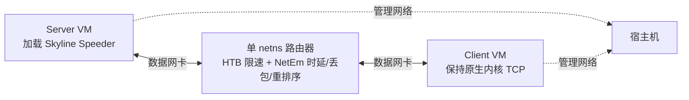

# Skyline Speeder 性能验证报告

**本报告只呈现单一构建版本的验证结果，全篇结果均来自附录 A 列出的构建
指纹（BPF 对象 SHA-256）。** 这不是性能对比之外任何其他结论的来源——不做
公平性评估，不做穷举系数扫描，不是网格密度意义上的"完整"矩阵，只回答一
个问题：这套构建在目标部署环境和护栏场景下，相对内核默认 BBR 表现如何。
模块全关路径的中性性属于正确性检查、不是性能对比，不在本报告内，见
`docs/03-design.md` 第 4 节。

> **本报告测的不是当前的出厂默认系数。** 全篇的 `skyline-best` 用的是报告测量
> 时的默认值（第 3.4 节列出），它现在以「高随机丢包档」的名字保留在
> `docs/usage.md` 里；实验矩阵自身的系数默认值（`research/experiments/
> matrix_lib.py`）也钉在这一组上，所以本报告仍可复现。当前出厂默认值是后来
> 在生产部署上调出来的另一组（见 `docs/03-design.md` 第 12 节），**没有在这套
> 测试台矩阵上重跑过，本报告的任何数字都不适用于它**。

## 1. 摘要与主要结论

1. **目标环境全 9 点网格上，`skyline-best` 反超默认 BBR**（第 4.1 节），
   且都远超"至少领先 5%"这一验收判据。
2. **`reorder-dsack`（不在目标环境范围内）是唯一 Skyline Speeder 不如 BBR 的场景**
   （第 5 节，比 BBR 低约 13%），差距明确不是调优目标。
3. **队列时延/ECN 护栏的自保护降速（`guardrail_gain=0.8`）在最容易触发护
   栏的场景上没有引入回归**：对比 `guardrail_gain=0.0`（钳位到中性 1.0，
   不主动降速）的对照配置，最担心的 0% 丢包高频触发场景差异 <0.01%
   （第 6.1 节）。
4. **M1 tier-2 的 `TCP_RTO_MAX_MS` 上限调节有直接实测证据**：有上限的配置
   在强制 RTO 场景下 3/3 全部存活、RTO 稳定钳在目标值附近；没有上限的对照
   组（含纯内核默认的 BBR）曾实测到 RTO 被顶到约 101 秒，逼近内核 120 秒
   默认上限（第 6.2 节）。
5. **链路波动场景下两个 Skyline Speeder 变体依然反超默认 BBR**（第 6.3
   节），但吞吐的运行间变异系数明显高于静态场景，与"拥塞证据触发次数"的
   波动相关。
6. **重传包 DSCP 标记在 IPv4/IPv6 下均正确工作，零误标记**（第 6.4 节）。
7. **内核版本适配性**：验证支持 6.12 LTS 及以后版本；`6.1.x`/`6.6.x` 因
   内核 struct_ops 接口签名差异明确不支持（第 7 节）。

## 2. 测试环境与有效性边界

### 2.1 测试床拓扑

两台 4 vCPU KVM guest + 单 netns 路由器；Server 端加载 Skyline Speeder，Client 端保持
原生内核 TCP，对客户端完全透明。

### 2.2 被测构建

见附录 A 的完整构建指纹表。第 4-6 节的目标环境/护栏/机制验证数据来自同一
次构建；第 6.4 节的 DSCP 标记验证和第 7 节的内核适配性验证各自使用独立的
构建（BPF 源码逐字节相同，仅编译目标内核不同），指纹分别列在对应小节。

发布前额外用当前最新构建（即本文档发布时的代码状态）在目标环境代表性场景
（`rtt200-loss15`）上做过一次小规模复核（`n=2`）：不加速的中性对照（模块全关的
`b2-skyline-base`）两次复核数值与原始主运行几乎完全一致——这个对照在该场景的数值
不在本报告的表格里，原始运行数据也不随报告交付（见附录 A），这一点本报告无法让读者
自行核对；`skyline-best` 复核数值比第 4.1 节主数据低约 6.5%，两组置信区间不重叠。
核对确认 `skyline_cc.bpf.c`（拥塞控制决策代码本身）在两次构建之间逐字节未变，
不加速的对照在两次运行之间又高度一致，判断这个差异更可能是小样本（`n=2`）下的
运行间噪声，而不是代码变化导致的真实回归——但没有更大样本量的数据能完全排除存在
一个小的真实差异。这次复核用的构建与场景见附录 A。

### 2.3 有效性边界

- **带宽轴上限**：`offload=off` 才能产生真正的逐包独立随机丢包（否则
  NetEm 会把丢包聚合成偶发整帧丢弃，丢包模型失真），这把测试台吞吐天花板
  压到约 100-150 Mbit/s，目标环境场景统一 `rate_mbit=100`；"数百 Mbps"是
  已声明的外推，未在测试台上直接验证。
- **BBR 无法调参**：这套内核构建的 BBRv1 实现全部内部参数都是编译期常量，
  没有任何运行时可调接口，本报告的对比对象始终是默认配置的 `bbr-fq`。
- **测试台已知未解问题**：`ethtool -k` 确认 `tso`/`gso`/`gro` 全部关闭时，
  TC 钩子仍能看到部分 skb 的 `gso_segs>1`（跟具体拥塞控制算法无关，已用隔
  离连接复现），而抓包里包长度全是 MTU、没有真实超帧——`offload=off` 是否
  真的完全保证了"逐包独立随机丢包"这件事本身尚未根因排查。依赖这个丢包
  模型保真度的结论应留意这一点。

### 2.4 验收判据定义

**主判据**：`median(skyline-best) ≥ 1.05 × median(bbr-fq)`。

**稳健性判据**：`min_over_runs(skyline-best) > max_over_runs(bbr-fq 各次)`——
BBR 在部分场景呈双峰分布，小样本下用它的中位数做门槛不稳，改用"Skyline Speeder 的最
小值仍大于对方任何一次跑出来的最大值"这种不受抽样运气影响的判据。

不达标的点如实记录，不隐藏、不为了让某一项通过而重跑挑数据。

## 3. 场景与 Profile 定义

### 3.1 目标环境场景网格

`rtt_ms ∈ {100,200,300} × loss_pct ∈ {10,15,20}%`，统一 `rate_mbit=100`、
`queue_bdp=1.0`、`loss_model="random"`、`offload="off"`，共 9 个场景，ID 形
如 `rtt200-loss15`。

带宽敏感性场景：同一 `rtt200-loss15`，`rate_mbit` 取 10/20/30/60/100 五点。

### 3.2 目标环境外的护栏场景

以下场景不在目标部署环境范围内，只用于确认没有在非目标场景上产生退化，
不是调优目标：

| 场景 ID | rtt_ms | rate_mbit | 丢包 | 重排序 | 定位 |
|---|---:|---:|---|---|---|
| `line-rate` | 20 | 1000 | 0% | — | 无损高速；模块全关中性性门槛（见 `docs/03-design.md` 第 4 节） |
| `light-loss` | 80 | 500 | 0.1% random | — | 轻度随机丢包 |
| `primary` | 150 | 500 | 0.5% random | — | 中等距离中等丢包 |
| `heavy-loss` | 250 | 100 | 2.0% random | — | 重丢包 |
| `burst-loss` | 150 | 500 | 0.5% gemodel，突发长度 5 | — | 突发（成簇）丢包 |
| `reorder-dsack` | 100 | 500 | 0% | 25%，相关性 10% | 纯重排序 |
| `intercontinental-clean` | 400 | 1000 | 0% | — | 跨国无损对照 |

### 3.3 链路波动场景

单个 case 内实时热更新路由器 NetEm/HTB 参数（`tc ... change`，不中断连接、
不清零 qdisc 计数器）：`volatile-bandwidth-cliff`（`rtt_ms=300`）分四段——
`[0,20)s` 平稳 `rate=100Mbit`；`[20,35)s` 骤降到 `rate=15Mbit`（队列包数锁
定，让排队时延真实放大）、仍不丢包；`[35,43)s` 同样低带宽下叠加一次真实
丢包突发（gemodel 8%）；`[43,59)s` 恢复到 `rate=100Mbit`。

### 3.4 Profile 定义

| Profile ID | `cc` | 说明 |
|---|---|---|
| `bbr-fq` | `bbr` | 业界标准对照 |
| `b2-skyline-base` | `skyline_cc` | Skyline Speeder 框架但四个可选模块全关，中性基线（中性性验证见 `docs/03-design.md` 第 4 节） |
| `skyline-best` | `skyline_cc` | 全部模块开启，报告测量时的默认系数：`cruise_inflight_gain` 2.0 / `cruise_pacing_gain` 1.1 / `loss_inflation_max_ratio` 0.5 / 护栏 100ms·1.0× / `min_rtt_window_s` 10 / `bw_window_rtts` 10 / STARTUP 退出 3 轮·25%（**不是**当前出厂默认值，见文首说明） |

实验 manifest（`research/experiments/manifests/`）里还定义了其他内核原生算法的
基线 profile；本报告只与 `bbr-fq` 对比，不列出它们。

以下是围绕 `skyline-best` 的对照用配置变体，各自只改一个系数，用来隔离该系数
的影响：

| Profile ID | 与 `skyline-best` 的差异 |
|---|---|
| `skyline-guardrail-neutral` | `guardrail_gain=0.0`（护栏只取消加速，不主动降速） |
| `skyline-rto-baseline` | 完全省略 `[rack_rto]`（RTO 上限调节关闭） |
| `skyline-relaxed-congestion-ratio` | `rto_max_congestion_ratio_permille=1500`（拥塞证据判定阈值从默认 2x 放宽到 1.5x） |

`cruise_inflight_gain`（2.0）/`cruise_pacing_gain`（1.1）的选定依据：cwnd
增益刻意比 pacing 增益更宽松（cwnd 只需不成为限制因素，真正的限速器是
pacing），具体数值在目标环境网格上按吞吐与自伤风险权衡选定，完整系数说
明见 `docs/03-design.md` 第 12 节。

## 4. 目标环境结果

### 4.1 9 点网格

（单位 Mbit/s，`n=2`，`median`/`min`）

| 场景 | bbr 中位数 | bbr 最小值 | skyline 中位数 | skyline 最小值 | vs bbr |
|---|---:|---:|---:|---:|---:|
| `rtt100-loss10` | 84.28 | 84.14 | 95.36 | 94.75 | 113% |
| `rtt100-loss15` | 79.61 | 79.10 | 95.74 | 95.00 | 120% |
| `rtt100-loss20` | 3.54 | 1.38 | 94.92 | 94.71 | 2678% |
| `rtt200-loss10` | 76.86 | 73.90 | 94.88 | 93.49 | 123% |
| `rtt200-loss15` | 30.89 | 19.04 | 95.04 | 91.81 | 308% |
| `rtt200-loss20` | 21.16 | 0.46 | 95.13 | 93.28 | 450% |
| `rtt300-loss10` | 80.66 | 79.57 | 90.24 | 89.84 | 112% |
| `rtt300-loss15` | 10.88 | 10.11 | 79.44 | 74.91 | 730% |
| `rtt300-loss20` | 3.48 | 3.10 | 79.92 | 77.43 | 2296% |

**9/9 点主判据与稳健性判据全部通过。**

### 4.2 高 RTT 端加样本（`n=5`）

对目标环境里 RTT 最高的三个点补充样本以收紧置信区间：

| 场景 | skyline 中位数（`n=5`） | bbr 中位数 | 比值 | skyline 最小值 | bbr 最大值（各次） | 稳健性 | skyline CV% |
|---|---:|---:|---:|---:|---:|---|---:|
| `rtt300-loss10` | 90.01 | 81.41 | 1.11x | 88.46 | 82.63 | 通过 | 3.2% |
| `rtt300-loss15` | 83.80 | 4.32（中位数）/75.46（单次最高） | 19.4x | 80.61 | 75.46 | 通过 | 3.7% |
| `rtt300-loss20` | 75.75 | 2.06（中位数）/48.23（单次最高） | 36.9x | 73.57 | 48.23 | 通过 | 2.6% |

`rtt300-loss15`/`-loss20` 的 BBR 中位数远低于其单次最高值，是 BBR 在
这两点上双峰分布的直接体现；即便用更保守的"跟 BBR 历史最高单次比"这
个稳健性判据，Skyline Speeder 仍全部通过。`n=5` 下 Skyline Speeder 自身 CV 都在 4% 以内。

### 4.3 带宽敏感性

（`rtt200-loss15`，`rate_mbit` 五点，单位 Mbit/s）

| 带宽 | bbr 中位数（range） | skyline 中位数（range） |
|---:|---:|---:|
| 10 Mbit | 4.3（0.8-7.8） | **9.4**（9.26-9.47） |
| 20 Mbit | 15.6（15.5-15.7） | **18.6**（18.0-19.2） |
| 30 Mbit | 6.5（2.7-10.4） | **28.3**（28.2-28.4） |
| 60 Mbit | 5.9（2.7-9.2） | **56.5**（55.7-57.3） |
| 100 Mbit | 76.9（75.7-78.1） | **95.7**（95.7-95.8） |

Skyline Speeder 在全部 5 个带宽点稳定跑赢 BBR、且方差远小于 BBR（BBR 在 10/30/60
Mbit 三点上都是双峰分布，单次运行可以差 3-4 倍）。10/20 Mbit 低端点上 Skyline Speeder
有小幅欠冲（比标称带宽低 2-10%，`initial_cwnd_packets=100` 在这么低带宽下
已经超过 BDP），如实记录这个已知的小幅限制。

## 5. 目标环境外场景的回归护栏

以下场景不在目标部署环境范围内，仅用于确认未在非目标场景上产生退化：

（`n=3`，中位数，单位 Mbit/s）

| 场景 | bbr | skyline-best |
|---|---:|---:|
| `intercontinental-clean` | 432.50 | 884.34 |
| `line-rate` | 935.09 | 956.41 |
| `light-loss` | 466.58 | 477.95 |
| `primary` | 452.04 | 463.37 |
| `heavy-loss` | 88.60 | 93.85 |
| `burst-loss` | 458.86 | 467.49 |
| `reorder-dsack` | 459.77 | 397.76 |

**`reorder-dsack` 是唯一 Skyline Speeder 不如 BBR 的场景**（比 BBR 低约
13%）——这是纯重排序场景，不在目标环境范围内，如实记录，不作调优目标。
其余场景 Skyline Speeder 均反超或持平 BBR。

## 6. 机制层验证

### 6.1 队列时延/ECN 护栏的自保护降速

**机制**：护栏触发（队列时延超过阈值，或出现新鲜 ECN CE 标记）时，把该
轮的 cwnd 目标增益和 pacing 增益都钳位到 `guardrail_gain`（默认 0.8，即降
到测得带宽的 80%）；`0.0` 表示只取消加速、不主动降速。每轮从零重新判定，
不是粘性状态。

**验证**（`{skyline-best, skyline-guardrail-neutral}` × 7 个历史高频触发场景 ×
`n=3`，单位 Mbit/s，中位数）：

| 场景 | skyline-best | skyline-guardrail-neutral | 差异 | guardrail_hits（3 轮合计，best/neutral） |
|---|---:|---:|---:|---:|
| `intercontinental-clean` | 884.34 | 884.35 | <0.01% | 207811 / 207907 |
| `line-rate` | 956.41 | 956.41 | 0% | 4 / 11 |
| `light-loss` | 477.95 | 478.22 | -0.06% | 14 / 29 |
| `primary` | 463.37 | 480.53 | -3.6% | 28 / 17 |
| `heavy-loss` | 93.85 | 95.56 | -1.8% | 11 / 14 |
| `burst-loss` | 467.49 | 478.22 | -2.2% | 35 / 27 |
| `reorder-dsack` | 397.76 | 413.24 | -3.7% | 84 / 95 |

`intercontinental-clean`（护栏触发极频繁，3 次运行合计 20.8 万次）下两者
差异 <0.01%——这条流早已被链路带宽本身（而非护栏）限速在满速附近，0.8x
系数应用在一个已经被其他约束钳住的增益上，不改变收敛后的稳态吞吐。其余
场景的小幅下降（2-4%）是护栏真正生效时"自保护降速"这一设计本身预期的代
价（用一点吞吐换队列时延/ECN 安全边际），不是缺陷。

### 6.2 M1 tier-2：`TCP_RTO_MAX_MS` 上限调节

**机制**：`ceiling = clamp(k × base_rtt, 1000ms, 120000ms)`，无拥塞证据
时 `k=rto_max_normal_permille`（默认 3x），检测到真实拥塞证据（新鲜 CE 标
记，或 srtt 相对 min_rtt 明显增长）后切换到 `rto_max_congested_permille`
（默认 6x），不回退内核 120 秒默认值。

**强制超时场景实测**（`forced-rto-burst-rtt300`：`rtt_ms=300`、
`rate_mbit=15`、Gilbert-Elliott 突发丢包 8%）：

| profile | 有效/总 | `rack_rto_max_applied`（每轮） | `rack_rto_max_rejected` | `max_rto_ms`（各轮） |
|---|---:|---:|---:|---:|
| `skyline-best`（上限开） | 3/3 | 12-15 | 0 | 902 / 1086 / 1129 |
| `skyline-rto-baseline`（上限关） | 1/3 | — | — | 902（唯一有效样本） |
| `bbr-fq`（无 Skyline Speeder，内核原生） | 3/3 | — | — | 902 / 4016 / **100992** |

`skyline-best` 的 3 个有效样本 `max_rto_ms` 全部稳定钳在 902-1129ms，贴着
`3x base_rtt≈900ms` 的目标值，`rack_rto_max_rejected` 全部为 0（机制被调
用且内核接受）。对照的 `bbr-fq`（完全没有 Skyline Speeder、纯内核默认行为）三次运行
的 `max_rto_ms` 波动极大，其中一次采样到 **100992ms**（约 101 秒，逼近内
核 `TCP_RTO_MAX` 120 秒默认上限）；`skyline-rto-baseline`（同样没有上限）
在这个场景下有效率只有 33%——大多数运行直接被拖入内核默认的级联
超时、被超时保护提前判为无效样本，这个"存活率"本身就是上限调节要防止的
问题最直接的证据。

**链路波动场景下的拥塞证据分支**（`volatile-bandwidth-cliff`，`n=3`）：

| profile | `rack_rto_max_applied`（各轮） | `rack_rto_max_rejected` | `rack_rto_max_congested`（各轮） | `max_rto_ms`（各轮） |
|---|---|---:|---|---|
| `skyline-best`（阈值 2x 默认） | 21 / 22 / 10 | 0 / 0 / 0 | 2 / 2 / 0 | 4812 / 3677 / 1359 |
| `skyline-relaxed-congestion-ratio`（阈值 1.5x） | 22 / 18 / 20 | 0 / 0 / 0 | 11 / 13 / 14 | 3850 / 4334 / 2559 |

`rack_rto_max_applied>0` 且 `rack_rto_max_rejected==0` 在全部 6 个 case 里
成立。把拥塞证据判定阈值从默认 2x 放宽到 1.5x 后，`rack_rto_max_congested`
触发次数从平均约 1.3 次/轮跳到约 12.7 次/轮，稳定跨 3 次独立运行都是数量
级差异，确认了阈值本身是限制这条分支触发频率的主要因素。`max_rto_ms` 普
遍远高于按标称 `base_rtt=300ms` 算出的 900/1800ms 标称值——这是预期内的：
ceiling 公式里的 `base_rtt` 在骤降+丢包窗口里本身被真实抬高到数秒量级，
6x 乘在这个已经膨胀的 base 上，不是乘在标称 300ms 上。

**仍未直接证实的一点**：`rack_rto_max_congested` 计数器在每一次 RTT 回调
只要证据成立就自增，跟"是否真的发生了一次 RTO 超时"没有逐事件级别的直接
对应关系——现有数据能证实"证据成立的整体频率"和"实测 `max_rto_ms`"方向一
致，但不是"某一次具体 RTO 超时发生时，ceiling 确实用的是 6x 而不是 3x"这
种逐事件级别的直接证据。

### 6.3 链路波动场景下的整体表现

（`volatile-bandwidth-cliff`，整案例吞吐，`n=3`，中位数，单位 Mbit/s——这
是全程四个 segment 混合平均后的数字）：

| profile | 中位数 | CV | vs bbr |
|---|---:|---:|---:|
| `bbr-fq` | 51.92 | 5.1% | — |
| `skyline-best` | 54.43 | 36.1% | +4.8% |
| `skyline-relaxed-congestion-ratio` | 57.79 | 2.2% | +11.3% |

两个 Skyline Speeder 变体仍反超 BBR，但 `skyline-best` 自身的运行间变异系数达
36.1%，与拥塞证据触发次数的波动方向一致（触发 0 次的那一轮 `max_rto_ms`
仅 1359ms，触发 2 次的那两轮达到 3677-4812ms，吞吐随之波动）——`n=3` 下不
足以把两者的关系量化，只能如实指出相关性。`skyline-relaxed-congestion-ratio`
（CV 仅 2.2%）在这个波动场景下表现更稳定、吞吐也更高，是否应该调低默认
阈值是一个值得后续更大样本验证的方向，本报告不直接改默认值。

**分段吞吐的测量局限**：按 segment 时间边界拆分 iperf3 的 0.5 秒采样窗口
后发现，Skyline Speeder 系列 profile 的分段均值和中位数差距悬殊（Skyline Speeder 的 pacing 发送
本身是突发式的，0.5 秒窗口经常整个落在两次突发之间报 0，偶尔一次窗口接住
一次真实 RTO 后的补发突发能报出远超限速的瞬时值）——这是发送模式本身的真
实特征，不是统计代码问题，但意味着分段吞吐的均值对 Skyline Speeder 系列 profile 不能
直接采信，只能参考中位数。本节 6.3 的整案例吞吐（来自 iperf3 自己的整段
汇总）不受这个问题影响，是本报告链路波动场景下唯一采信的吞吐指标。

### 6.4 重传包 DSCP 标记（IPv4/IPv6）

**机制**：`skyline_tc.bpf.c` 在发送网卡出方向检测重传的 TCP 段（比较包自己的
序列号和 `bpf_tcp_sock(sk)->snd_nxt`），命中则打上配置好的 DSCP 编码。接
口级挂载，不分 cgroup，对该接口上全部 TCP 流一致生效，不区分用的是哪种拥
塞控制算法。

**验证**（真实抓包核对，`retransmit_capture_marked`=抓包确认打上标记的重
传段数，`retransmit_capture_false_positives`=错误标记的非重传段数）：

| 地址族 | 场景组合 | 覆盖的 profile | 抓包确认标记数 | 误标记数 |
|---|---|---|---:|---:|
| IPv4 | 有丢包机制场景 + 零丢包对照 | 内核原生算法基线（`bbr-fq` 等，含 DSCP 关闭/自定义编码对照）/`skyline-best` | 累计约 5 万次 | **0** |
| IPv6 | 同上（v6 扩展头解析路径） | 同上 | 累计约 4.7 万次 | **0** |

**12 个 IPv4 case + 12 个 IPv6 case 全部有效，零误标记。** DSCP 关闭
（`bbr-fq-dscp-off`）时标记数恒为 0，确认开关本身正确生效；不同 DSCP 编码
值（`bbr-fq-dscp46`）下标记行为一致，确认编码值是纯粹的可配置占位参数，
不影响标记机制本身。IPv6 路径的扩展头遍历（有界展开，遇到分片/认证头/未
知扩展头一律放行不处理）在这组验证里没有产生任何误标记。

## 7. 内核版本适配性

对 `6.1.180`/`6.6.148`/`6.12.101`/`6.18.42`/`7.1.6` 五个内核版本做过适配
性冒烟验证（正确性/兼容性为主，不是本报告前述章节的性能验证口径）：

| 版本 | 结果 |
|---|---|
| `6.1.180` | 不支持——见下方根因 |
| `6.6.148` | 不支持——见下方根因 |
| `6.12.101` | 通过，含 IPv4/IPv6 数据面冒烟 |
| `6.18.42` | 通过，含 IPv4/IPv6 数据面冒烟 |
| `7.1.6` | 通过，含 IPv4/IPv6 数据面冒烟 |

**根因（对照本地内核源码树 + 上游内核标签核实，非猜测）**：`skyline_cc.bpf.c`
挂在 `struct tcp_congestion_ops.cong_control` 上的回调用 4 个参数声明
（`sk, ack, flag, rs`）。这个签名是内核从版本 6.10 才开始使用的——6.9 及
更早版本的 `cong_control` 函数指针类型只有 2 个参数（`sk, rs`），BPF 验证
器加载时直接拒绝，报错明确指向参数个数不匹配。`6.1.x`/`6.6.x` 都在这个
版本边界之前。`skyline_tc`（重传 DSCP 标记）和 `skyline_policy`（M1 tier-2 动态
RTO）不碰 `cong_control`，不受影响。

**支持范围**：精确 ABI 下限是内核 6.10（含）以上；`6.10`/`6.11` 满足 ABI
但不是 LTS、支持周期太短，不建议依赖；已验证并承诺支持的下限是 **6.12
LTS**。

## 8. 局限性与未覆盖项

- **完全不响应丢包是有代价的**：在真实**拥塞型**瓶颈（而非随机丢包）上，
  Skyline Speeder 会持续加压、自伤并影响同路径其他流；队列时延/ECN 护栏（含 6.1 节的
  自保护降速）是唯一的自保护手段，在目标环境（随机丢包为主）内足够，但不
  是通用安全网。部署前需要评估目标链路的丢包成因是否确实以随机丢包为主。
- **带宽只验证到 100 Mbit/s**：`offload=off` 是测试台的结构性上限；"数百
  Mbps"是外推，未直接测量。
- **公平性未测量，且明确不是本报告的目标**。
- **`reorder-dsack` 场景 BBR 仍小幅领先**，这个场景不在目标环境范
  围内，不作调优目标。
- **BBR 无法调参**：这套内核构建的 BBRv1 没有任何运行时可调接口，对比对
  象始终是默认配置的 BBR。
- **M1 tier-2 下限调节在高 RTT 链路上的结构性限制**：`TCP_BPF_RTO_MIN` 的
  目标值受内核 `TCP_RTO_MIN`（200ms）约束；这条限制不影响上限调节（两者
  是独立机制）。
- **`guardrail_gain`/`rto_max` 的具体数值均未经过候选对比矩阵验证**：验证
  确认了两者真正激活后方向正确、没有引入回归，但 0.8/3x/6x 这三个数字本
  身仍是直接选定的初始值。
- **M1 tier-2 `rto_max` 的"拥塞证据"分支与真实 RTO 超时的逐事件级别同时性
  仍未直接证实**（见 6.2 节）——现有数据是整案例计数器/整案例最大值级别
  的相关性证据，不是逐事件级别的直接证据。
- **链路波动场景的分段吞吐均值对 Skyline Speeder 系列 profile 不可靠**（见 6.3 节），
  只能用中位数，且每段采样点数不算大（16-30 个）。
- **单一测试床**：全部结果来自单一 KVM 测试床（两台 4 vCPU guest + 单
  netns 路由器），未在不同硬件/虚拟化方案上复现。
- **`offload=off` 下丢包模型保真度的未解问题**：见 2.3 节的 `gso_segs`
  异常，尚未根因排查。

## 附录 A：数据来源与构建指纹

| 章节 | 数据来源（manifest） | 内核版本 | `skyline_cc.bpf.o` SHA-256（前 12 位） |
|---|---|---|---|
| 第 4/5/6.1/6.2/6.3 节 | 目标环境网格、带宽敏感性、护栏 A/B、RTO 上限验证、链路波动 | 6.18.40 | `1cb1d581c4f7` |
| 第 6.4 节（IPv4） | 重传 DSCP 机制验证（v4） | 6.18.40 | 独立构建，见运行目录 `environment.json` |
| 第 6.4 节（IPv6） | 重传 DSCP 机制验证（v6） | 6.18.40 | 独立构建，见运行目录 `environment.json` |
| 第 7 节 | 5 版本内核适配性冒烟 | 见表格 | 各版本独立构建，见各自运行目录 |
| 发布前复核（2.2 节） | 当前最新构建，`rtt200-loss15` + `line-rate`，`n=2` | 6.18.40 | 当前 HEAD 构建 |

完整原始运行数据（`runs.csv`/`summary.csv`/逐 case 详情）不随本报告交付，
复现方法见 `research/experiments/README.md`。
